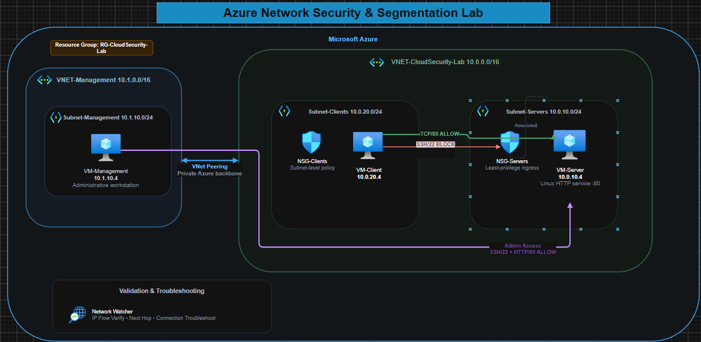
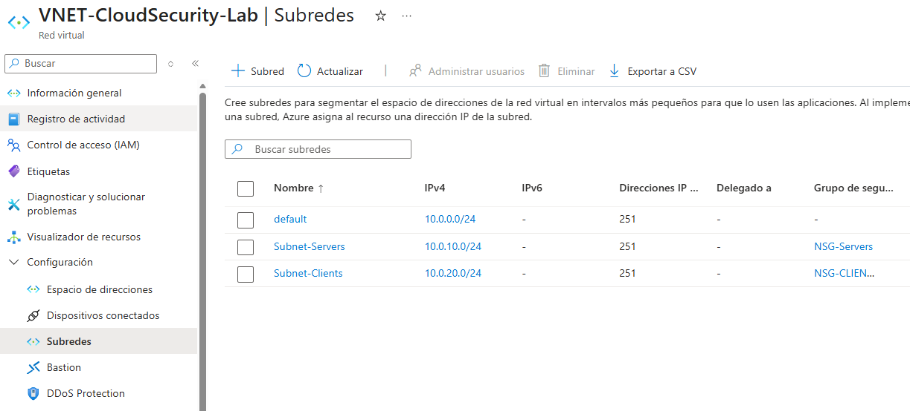
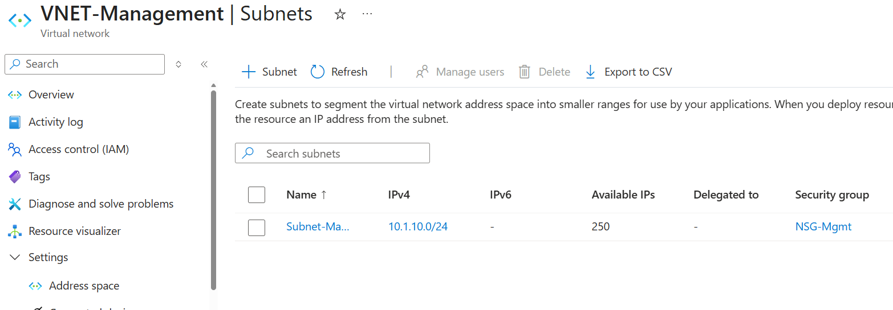
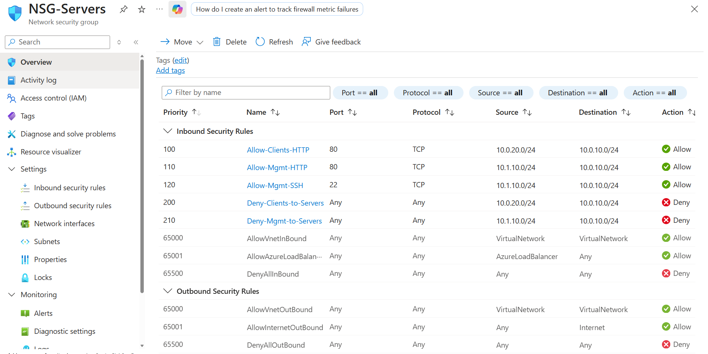
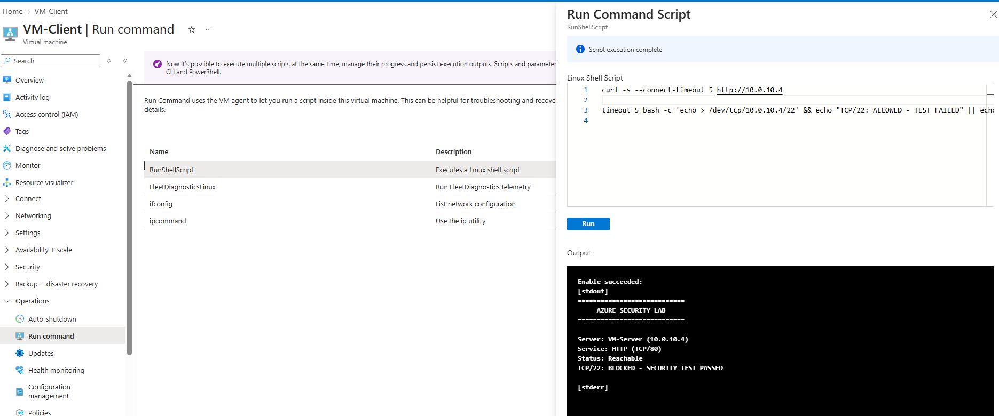
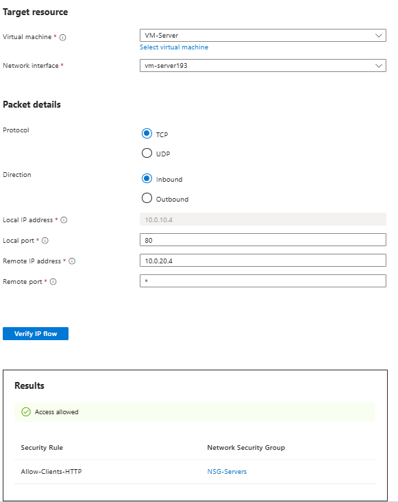
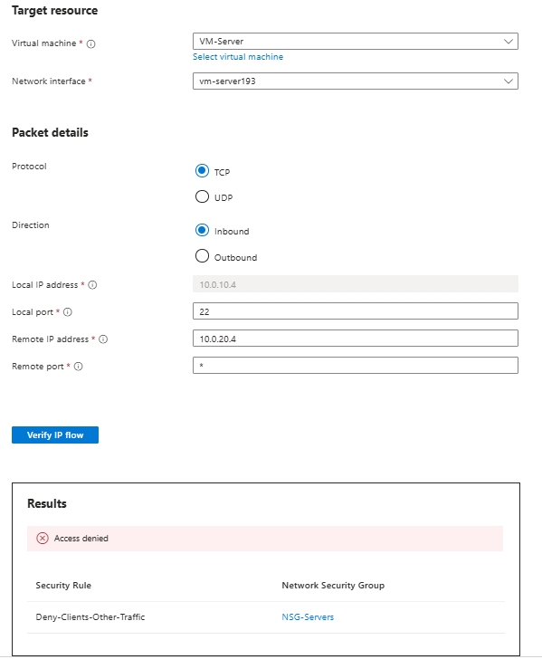
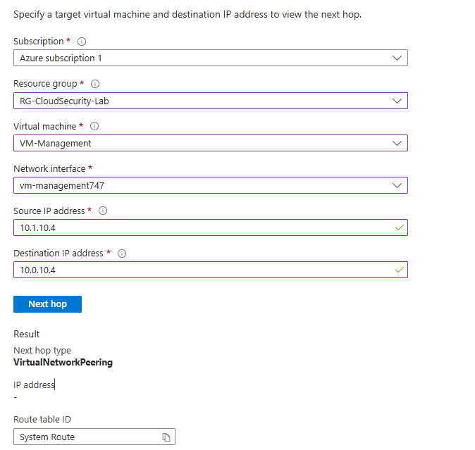

# Azure Network Security & Segmentation Lab

> A practical Azure network-security case study focused on segmentation, least-privilege access, routing behavior, private connectivity, validation, and troubleshooting.

## Overview

A growing organization is moving internal workloads to Microsoft Azure. Employees need access to an internal application, while IT needs a separate, private path to manage the servers behind it.

The design needs to:

- Allow users to reach only the application services they need.
- Block administrative access such as SSH from the client network.
- Keep privileged access inside a dedicated management network.
- Restrict unnecessary traffic between network segments.
- Keep server and management communication private within Azure.

The result is a segmented Azure environment using VNets, subnets, NSGs, custom routes, VNet Peering, Network Watcher, and Linux networking tools.

## Quick Navigation

- [Architecture](#architecture)
- [Network Design](#network-design)
- [Segmentation Evidence](#segmentation-evidence)
- [What should be allowed?](#what-should-be-allowed)
- [Enforcing the policy with NSGs](#enforcing-the-policy-with-nsgs)
- [Testing it like a real user](#testing-it-like-a-real-user)
- [What happens when routing breaks?](#what-happens-when-routing-breaks)
- [Adding a separate management network](#adding-a-separate-management-network)
- [Troubleshooting Case Study](#the-troubleshooting-moment-that-made-the-lab-worth-it)
- [What I used to validate the environment](#what-i-used-to-validate-the-environment)
- [What I learned](#what-i-learned)
- [Evidence](#evidence)
- [Next steps](#next-steps)

---

## Architecture

The design uses one VNet for normal workloads and a second VNet for management access.

<p align="center">
  <a href="architecture/azure-network-security-architecture.png">
    
  </a>
</p>

<p align="center"><em>Click the diagram to open the full-size architecture.</em></p>

---

## Network Design

| Component | CIDR / IP | What it is used for |
|---|---|---|
| `VNET-CloudSecurity-Lab` | `10.0.0.0/16` | Main workload network |
| `Subnet-Servers` | `10.0.10.0/24` | Server and application workloads |
| `Subnet-Clients` | `10.0.20.0/24` | Standard user/client workloads |
| `VNET-Management` | `10.1.0.0/16` | Separate administrative network |
| `Subnet-Management` | `10.1.10.0/24` | IT/Security management workloads |
| `VM-Server` | `10.0.10.4` | Ubuntu web/application server |
| `VM-Client` | `10.0.20.4` | Standard client machine |
| `VM-Management` | `10.1.10.4` | Administrative workstation |

### Segmentation Evidence

The main workload VNet separates clients from servers, while the management VNet keeps administrative traffic on its own network.

[](screenshots/01-vnet-subnets.png)

[](screenshots/1.5-vnet-subnets-mgmt.png)

---

## What should be allowed?

The policy is intentionally simple: normal users can reach the application, but administrative access stays on the management network.

### Client → Server

| Service | Policy | Security Purpose |
|---|---|---|
| HTTP `TCP/80` | **Allow** | Required application access |
| SSH `TCP/22` | **Deny** | Prevent administrative access from standard clients |
| Other unnecessary traffic | **Deny / Restrict** | Reduce unnecessary east-west access |

#### Management → Server

| Service | Policy | Security Purpose |
|---|---|---|
| SSH `TCP/22` | **Allow** | Server administration from the management network |
| HTTP `TCP/80` | **Allow** | Application validation and troubleshooting |
| Other unnecessary traffic | **Deny / Restrict** | Keep management access controlled |

---

## Enforcing the policy with NSGs

I applied Network Security Groups at the subnet level, with `NSG-Servers` protecting the server subnet.

The important part was not just creating allow and deny rules, but making the rules match the role of each network:

- Client subnet → application traffic only.
- Management subnet → approved administrative traffic.
- Everything else → restricted unless there is a reason to allow it.

[](screenshots/02-nsg-server-rules.png)

---

## Testing it like a real user

Before relying on Azure diagnostics, I tested the environment from the machines themselves.

From `VM-Client`:

- HTTP to `VM-Server` worked.
- SSH to `VM-Server` was blocked.

That gave me the behavior I wanted: the user can reach the service, but not the administrative interface behind it.

[](screenshots/03-client-security-validation.png)

Then I checked the same flows with **Azure Network Watcher**.

### HTTP — allowed

IP Flow Verify confirmed that TCP/80 matched the intended allow rule.

[](screenshots/04-ip-flow-http-allowed.png)

### SSH — denied

The same test confirmed that SSH from the client network was denied.

[](screenshots/05-ip-flow-ssh-denied.png)

---

## What happens when routing breaks?

I also wanted to test something that is easy to miss during troubleshooting: **an NSG can allow traffic and the connection can still fail because of routing.**

To prove that, I created a temporary route table called `RT-Clients` and added this User Defined Route:

```text
Name:        Block-Server-Subnet
Destination: 10.0.10.0/24
Next hop:    None
```

That route intentionally sent traffic to a black hole.

In other words, even if the security rule said “allow,” the packet still had no valid path to the server.

[](screenshots/06-routing-udr.png)

I removed the route after the test so normal connectivity was restored.

---

## Adding a separate management network

Instead of placing administrators in the same network as regular users, I created `VNET-Management` and connected it to the workload VNet through **VNet Peering**.

This gave the management VM a private path to the server without exposing the workloads with public IPs.

Network Watcher confirmed the routing decision:

```text
Source:        10.1.10.4
Destination:   10.0.10.4
Next Hop Type: VirtualNetworkPeering
Route:         System Route
```

[](screenshots/07-vnet-peering-validation.png)

---

## Troubleshooting Case Study

# Problem

During cross-VNet validation, I tested connectivity from VM-Management to the web service on VM-Server and got:

```text
connect to 10.0.10.4 port 80 failed: Connection refused
```

My first thought could have been “the firewall is blocking it,” but instead I checked the path one layer at a time.

I verified that:

- VNet Peering was working.
- Azure selected `VirtualNetworkPeering` as the next hop.
- The NSG allowed TCP/80.
- The route to the server was valid.

At that point the network looked healthy, so I checked the server itself:

```bash
sudo ss -lntp | grep ':80'
```

Nothing was listening on port 80.

The Python HTTP service had stopped after the VM was restarted.

I restarted the service, tested again, and got:

```text
HTTP/1.0 200 OK
```

The issue was not Azure networking at all — it was the application.

That was a good reminder that network troubleshooting is usually faster when you work through the layers instead of changing firewall rules until something starts working.

```text
Security policy → Routing → Peering → Host → Application
```

---

## What I used to validate the environment

During the lab I used:

- **IP Flow Verify** to see which NSG rule allowed or denied a connection.
- **Effective Security Rules** to check the policy actually applied to a workload.
- **Next Hop** to understand Azure's routing decision.
- **Connection Troubleshoot** to test connectivity end to end.
- **Network Topology** to review how the resources were connected.
- **curl, TCP tests, and Linux socket checks** to validate what was happening from the operating system itself.

---


## What this project demonstrates

This lab brings together several skills in one small environment:

- Azure network design and segmentation
- Network Security Groups
- Least-privilege access
- TCP/IP troubleshooting
- User Defined Routes
- VNet Peering
- Azure Network Watcher
- Linux networking
- Application-layer troubleshooting
- Security validation and documentation

---

## Evidence

| Evidence | What it shows |
|---|---|
| [Architecture diagram](architecture/azure-network-security-architecture.png) | Overall design |
| [VNet and subnet configuration](screenshots/01-vnet-subnets.png) | Network segmentation |
| [Management subnet configuration](screenshots/1.5-vnet-subnets-mgmt.png) | Dedicated management network |
| [NSG rules](screenshots/02-nsg-server-rules.png) | Traffic-control policy |
| [Client security validation](screenshots/03-client-security-validation.png) | HTTP allowed and SSH blocked |
| [IP Flow Verify — HTTP](screenshots/04-ip-flow-http-allowed.png) | Azure confirms the allow rule |
| [IP Flow Verify — SSH](screenshots/05-ip-flow-ssh-denied.png) | Azure confirms the deny rule |
| [UDR blackhole test](screenshots/06-routing-udr.png) | Routing failure scenario |
| [VNet Peering validation](screenshots/07-vnet-peering-validation.png) | Private cross-VNet routing |

---

## Next steps

A few ways I could extend the environment later:

- Azure Bastion for controlled administrative access
- Just-in-Time VM access
- Azure Firewall or an NVA for centralized inspection
- NSG flow logs and deeper traffic visibility
- Point-to-Site or Site-to-Site VPN connectivity

For this version, I intentionally kept the scope focused on **segmentation, access control, routing, private connectivity, and troubleshooting**.

---

## Technologies

`Microsoft Azure` · `Azure Virtual Networks` · `Network Security Groups` · `Network Segmentation` · `TCP/IP` · `User Defined Routes` · `VNet Peering` · `Azure Network Watcher` · `Ubuntu Linux` · `SSH` · `HTTP` · `Cloud Security` · `Network Troubleshooting`

---

## Documentation

Detailed implementation notes are available in [`docs/implementation-notes.md`](docs/implementation-notes.md).
